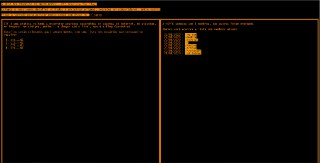

# hspfk-page
Landing page made for the HSPFK Capture The Flag (CTF) group

### The requirements
The client asked a page like a terminal emulator, with three tabs. The color should be orange or orange-like and with black background. The fonts should be "code-like" too, like the terminal ones. 

### The timeline
The client didn't issued a fixed timeline, but the landing page was finished in less than an hour.

### The challenges
The main challenge was to use CSS to divide the content in three different parts.

### Results
The client was over-satisfied and invited me to the HSPFK Admin group itself.

